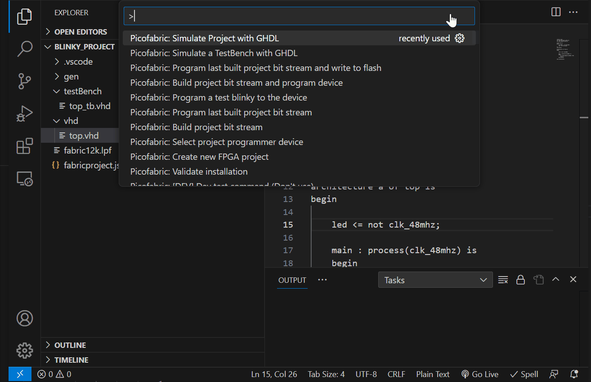
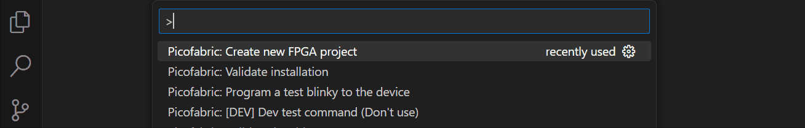
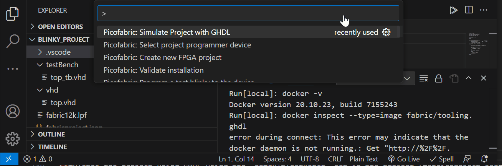
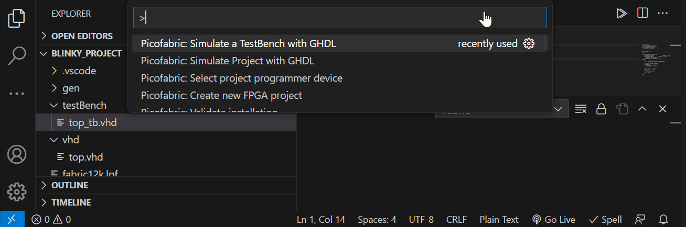
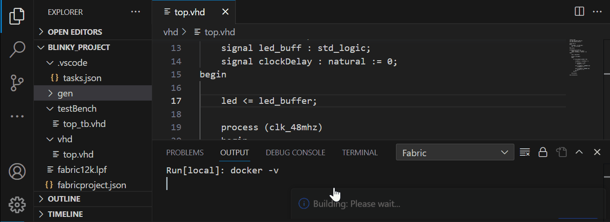
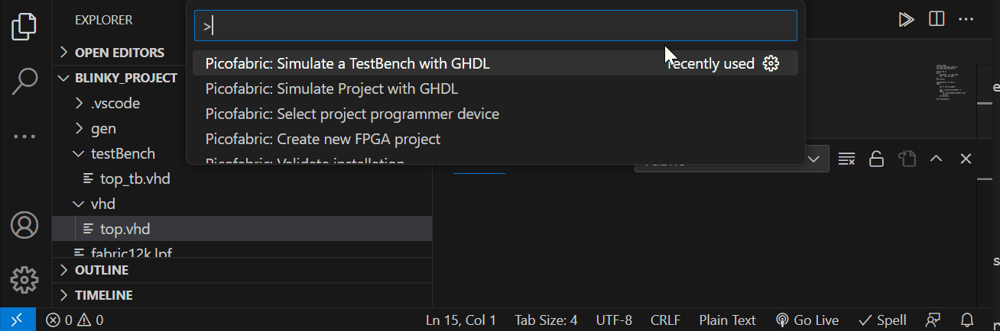
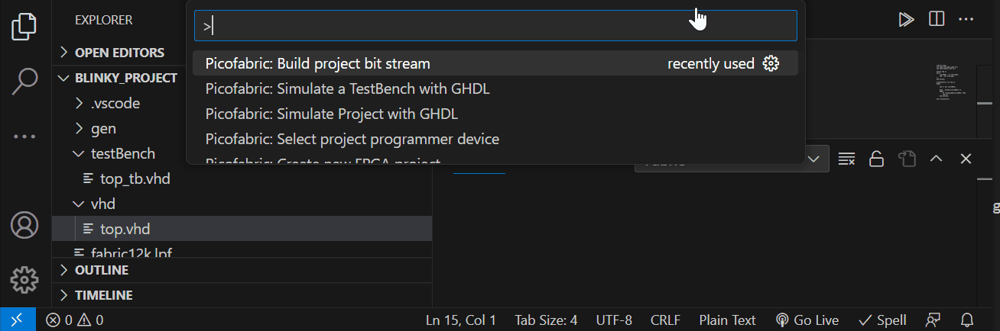
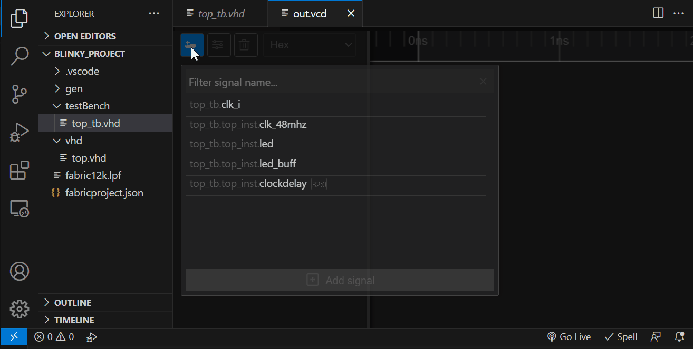
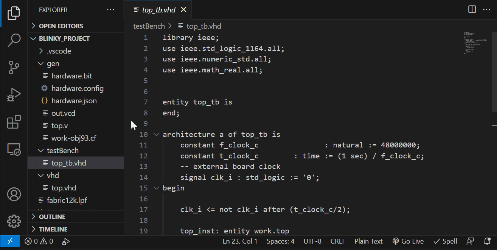

# PicoFabric IDE # 
[](https://github.com/picolemon/picofabric-ide)
[](https://github.com/picolemon/picofabric-hardware/doc/datasheet.pdf)
[](https://github.com/picolemon/picofabric-hardware/doc/sch.pdf)
[](http://picolemon.com/board/PICOFABRIC)
[](https://github.com/picolemon/picofabric-examples)
[](https://discord.gg/Be3yFCzyrp)



## Overview
Fully feature IDE for simulating, building and programming the PicoFabric FPGA development board.


## Whats included
- [x] Built for the PicoFabric development board with support for other ECP5 based FPGAs.
- [x] JSON based project file.
- [x] VHDL simulator.
- [x] VCD viewer with a smooth and responsive interface.
- [x] Bit-stream builder, build Verilog & VHDL projects.
- [x] FPGA board programmer.
- [x] Docker based tools for a fast and easy setup.


## Libraries
- [x] [PicoFabric MicroPython library](https://github.com/picolemon/picofabric-micropython)
- [x] [PicoFabric C/C++ library](https://github.com/picolemon/picofabric-c)
- [x] [VHDL, C & Python examples](https://github.com/picolemon/picofabric-examples)

## Requirements
- [Docker](https://www.docker.com/) (20.0 or above)
- [Visual Studio Code](https://code.visualstudio.com/) (1.77 or above)
- Windows (10 or above)
- MacOS (Monterey or above)
- Linux (20.04 or equivalent)	


## Installation

The VSCode extension will generally try to provide useful hints when a given software package not found or is required, for a manual installation follow the following steps:

- Download and install [Docker](https://www.docker.com/) (20.0 or above)
- Install the Visual Studio code extension by downloading the lastest .VSIX package from the [releases/](releases/) folder. To manually add the extension into Visual Studio open the Extensions tab ```Ctrl + Shift + x``` then select then "..." menu and click "Install from VSIX...".
- Validate the installation to build Docker images by running the following command 
```
(Ctrl + Shift + P) -> Validate installation
```
- Once the extension finds a valid docker installation it will automatically download and build the tool images required to run the ghdl simulator and ECP5 bit-stream build tools.

## Optional features
- (Optional) Download and install [Python](https://www.python.org/) (3.0 or above), make sure pip or pip3 package manager is installed as some python packages are required.
- (Optional) Install the pyserial python package required for the built in FPGA programmer for programming on the CLI, the extension includes a built in programmer which python is not required.
```
$ pip3 install pyserial
```

## Project setup

The PicoFabric IDE Uses a simple json file (fabricproject.json) to specify build directories, output and development boards. 

#### Project json specification ####
```
{
	// Synthesis directories inside the project for building bitstream & simulation, glob style pattern matching is used eg. ["/vhd/*.vhd", "/vhd/*.vhdl"]
	"synthDirs" : ["/vhd/*.vhd"],

	// Synthesis directories inside the project for simulation, glob style pattern matching is used eg. ["/testBench/*.vhd", "/testBench/*.vhdl"]
	"simDirs" : ["/testBench/*.vhd"],

	// Exclude directories from synthesis, glob style pattern is used
	"synthExcludeDirs" : [],

	// Exclude directories from simulation, glob style pattern is used
	"simExcludeDirs" : [],

	// Use case sensitive matching when including or excluding files
	"caseSensitiveFilter" : false,

	// Extra command line options to send to GHDL during syntheses
	"synthGhdlExtraOpts" : "-fsynopsys --std=08",

	// GHDL work library name argument
	"work" : "work",

	// Project top module name to synthesize
	"top" : "top",

	// Project default test bench name
	"defaultTestBench" : "top_tb",

	// Output verilog file name for VHDL to verilog translation pass
	"ghdlSynthOutputFilename" : "gen/top.v",

	// Synthesis temp build directory
	"buildDir" : "gen",

	// GHDL temp work directory
	"workdir" : "gen",

	// Max time to run simulation
	"defaultSimRunTimeMs" : 10,

	// Valid name of a supported board, the project wizard, the [command][createProject] & [command][selectProjectProgrammerDevice] commands can list and configure supported boards
	"boardName" : null,

	// Custom board definition, the [command][selectProjectProgrammerDevice] command and selecting custom board will create a default template, contact support for help on custom board integration
	"board" : null,

	// Constraints file used in synthesis
	"constraintsFilename" : null,

	// Output bit stream filename
	"outputBitStreamFilename" : "hardware.bit",

	// Extra commandline options to pass to the nextpnr process
	"nextpnrExtraOptions" : "--timing-allow-fail --force",

	// The com port of the preferred programmer
	"preferredProgrammerDeviceUri" : null,
}
```

#### Project commands ####
```
(Ctrl + Shift + P) -> Create new FPGA project
```

Creates a new project into the current workspace. Options are available to select a development board and base template.
<br /><br />

```
(Ctrl + Shift + P) -> Select project programmer device
```
Searches for programmer devices attached to all USB ports and sets the preferred device on the active workspace project.
<br /><br />

```
(Ctrl + Shift + P) -> Setup FPGA board project constraints
```
Add an FPGA constraints file provided by the active project development board.
<br /><br />

## Simulation

The PicoFabric IDE provide a VHDL simulator
- Supports VHDL (no current support for SystemVerilog or Verilog)
- [GHDL](https://github.com/ghdl/ghdl) based simulation.
- Integrates with the built in VCD viewer and streams output as it simulate.
- Test bench filenames must end with _tb to be valid and must be placed in the project (fabricproject.json) "simDirs" directory.
- Files can be excluded by setting the  project (fabricproject.json) "simExcludeDirs" property.
- Highlights problems in source code, no more searching through logs.

#### Simulation commands ####
```
(Ctrl + Shift + P) -> Simulate Project with GHDL
```

Simulates the project using GHDL using the "defaultTestBench" set in the project (fabricproject.json).
<br /><br />

```
(Ctrl + Shift + P) -> Simulate a TestBench with GHDL
```

Simulates a testbench from project using GHDL, the project (fabricproject.json) "simDirs" is searched for files ending with _tb eg. "top_tb.vhd".
<br /><br />


## Building and Synthesis

The PicoFabric IDE provides an ECP5 base synthesis toolset for building bit streams from VHDL sources.
- Translate VHDL to Verilog using GHDL.
- Uses yosys, nextpnr-ecp5 and ecppack.
- Supports the PicoFabric FPGA boards and other ECP5 based boards. Using other boards will require a separate programmer as the built-in one uses its own protocol over usb.
- Highlights problems in source code.


#### Building commands ####
```
(Ctrl + Shift + P) -> Build project bit stream
```

Builds the VHDL sources and outputs a bit stream in the t (fabricproject.json) "buildDir" directory.
<br /><br />

```
(Ctrl + Shift + P) -> Build project bit stream and program device
```
Builds the VHDL sources and outputs a bit stream in the project (fabricproject.json) "buildDir" directory and programs using the built in programmer defined by the board config set by the project.
<br /><br />

```
(Ctrl + Shift + P) -> Clear pending errors from the last command
```
Clear and errors reported in the "Problems" tab. 
<br /><br />


## Programming

The PicoFabric IDE provides a built in programmer for the PicoFabric development board. A UF2 bootloader image is deployed to the RP2040 device to provide bit stream programming and flash storage.

- UF2 Bootloader images for Pico programmer device.
- USB bitstream programmer.
- Run a precompiled test blinky on the device to verify basic functionality.
- program.py CLI programmer is provided in the extension resources directory or can be downloaded from [here](https://github.com/picolemon/picofabric-hardware/programmer/fabricSerialProgrammer).

The [MicroPython library](https://github.com/picolemon/picofabric-micropython) and [C/C++ library](https://github.com/picolemon/picofabric-c) provides a programmer for integration. This allows programming the device from code eg. the [Micro Python examples](https://github.com/picolemon/picofabric-examples/micropython) uses this feature to upload a bitstream before interacting with the FPGA.

#### Programming commands ####

```
(Ctrl + Shift + P) -> Program last built project bit stream
```

Program the last built bit stream from the project (fabricproject.json) "buildDir" directory.
<br /><br />

```
(Ctrl + Shift + P) -> Build project bit stream and program device
```
Build and program the device in one go.
<br /><br />


## VCD Viewer

<br /><br />
The PicoFabric IDE provides a minimal VCD viewer for inspecting register, vector & integer signal types.
- Basic Register & Vector VCD types, support for Real, Enum and other types will be added in the near future.
- Smooth scrolling and zooming for improved navigation.
- Zoom locking to cursor, viewport position locks to cursors when zooming in or out.
- Per signal appearance, radix and size.
- Secondary cursor for measuring time differences.
- Streaming from simulation, integrates with GHDL simulation for rapid sim to observation workflow.
- Open any project file with a .vcd file extensions in VSCode.
- 1 Femtosecond to 100 seconds resolution range.

#### Opening VCD files ####


Select a VCD file or drag one from explorer, VSCode will open files matching the .vcd extension into a new tab.
<br /><br />

#### Known issues
- The built-in VCD viewer doesn't handle large VCD files. gtkwave should be used for more complex simulations.
- Verilog files are not simulated due to missing GHDL support. Icarus Verilog support will be added in future releases.
- "Docker service not running" error is raised.	Start the docker service manually by running the Docker desktop application.
- Commands fail to run after starting the docker service. Re-run the command ( multiple times if necessary ) as the service can take a while to start. Future versions will ensure the service is fully running before executing commands.

## Support
- Drop by the [discord](https://discord.gg/Be3yFCzyrp)
- Email help@picolemon.com

Copyright (c) 2023 picoLemon
